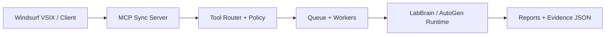
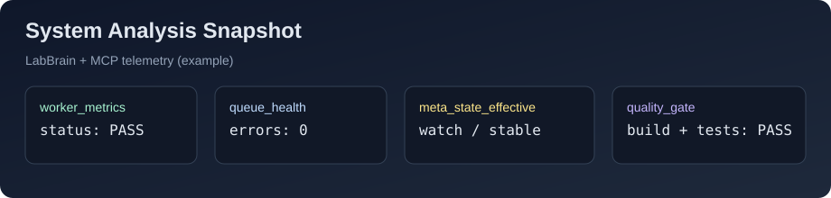
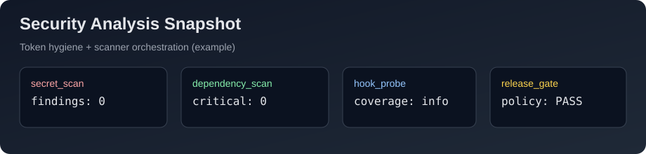

# MCP Sync Server

[](https://github.com/Vasyl198/mcp-sync-server/actions/workflows/ci.yml)


Production-oriented MCP server for local/edge AI workflows: tool routing, queue execution, task graph operations, and sync endpoints.

## Architecture



## Quick Demo

```powershell
cd C:\Users\anani\Projects\mcp-sync-server
npm ci
npm run build
npm start
```

Then verify:

```powershell
Invoke-RestMethod http://127.0.0.1:3000/health
```

Server defaults:
- URL: `http://127.0.0.1:3000`
- Health: `GET /health`
- MCP: `/mcp`

## Build and Test

```powershell
npm run build
npm test
```

CI (`.github/workflows/ci.yml`) runs:
1. `npm ci`
2. `npm run build`
3. `npm test`
4. build artifact check (`dist/index.js`)

## Analysis Snapshots




Example report artifacts:
- `_sync/autogen_learning/quality_tick_latest.json`
- `_sync/external_analysis/hook_probe_latest.json`
- `_sync/external_analysis/security_mode_latest.json`

## Feature Matrix

| Feature | Status | Evidence |
|---|---|---|
| MCP transport + auth-gated routes | ✅ | `/health`, `/mcp`, `AUTH_ENABLED`, `MCP_SYNC_TOKEN` |
| Queue + worker execution | ✅ | `worker_metrics_snapshot`, `job_history_list` |
| Tool routing + policy | ✅ | `whoami`, `tasks`, `sync`, `fs`, `exec` |
| Security gate mode | ✅ | `security_mode_latest.json` |
| Hook detection for external targets | ✅ | `hook_probe_latest.json` |
| CI build and smoke tests | ✅ | GitHub Actions `ci.yml` |

## Commercial Readiness

Recommended KPI targets for pilots:

| KPI | Target |
|---|---|
| Success rate | `>= 90%` |
| Critical errors | `0` |
| Rollback rate | `<= 5%` |
| Unsafe claims on operational facts | `~0` |
| Time-to-evidence (p95) | per agreed SLA |

## Auth

Bearer auth is controlled by:
- `MCP_SYNC_TOKEN` - expected token value for `Authorization: Bearer <token>`
- `AUTH_ENABLED`:
  - `true|1|on|enabled`: force auth on
  - `false|0|off|disabled`: force auth off (dev only)
  - empty: auto mode (on when token is set)

Protected routes when auth is enabled:
- `/mcp`
- `/messages`
- `/sse`
- `/sse-simple`

## Development

```powershell
npm run dev
```

## Security

See `SECURITY.md` for vulnerability reporting and token hygiene requirements.

## Tests Layout

Root-level test scripts were moved into `tests/` to keep repository root clean.

## Commercial Setup (Variant 1)

1. Generate a strong bearer token.
2. Set `AUTH_ENABLED=true`.
3. Set `MCP_ALLOWED_ROOTS` to the client repository root.
4. Set `MCP_ALLOWED_ORIGINS` to client domain + localhost.
5. Run security/token checks before release.

## Offer: MCP + Security Gate Pilot (48h)

Deliverables:
- Working MCP workflow for the target repo/service.
- Security + quality evidence report (JSON + short summary).
- Runbook with remediation priorities and release gate verdict.

Typical pilot goals:
- reduce release risk,
- detect critical security misconfigurations early,
- enforce evidence-first GO/NO-GO.

## Contact / Book Pilot

- GitHub Issues:
  - Pilot: `.github/ISSUE_TEMPLATE/pilot_request.md`
  - Bug: `.github/ISSUE_TEMPLATE/bug_report.md`
  - Feature: `.github/ISSUE_TEMPLATE/feature_request.md`
- Email: `your-email@domain.com`
- Optional intake template:
  - target repository/service
  - stack (Node/Python/etc.)
  - required deadline
  - compliance/security constraints
  - expected outcome (GO/NO-GO, report, remediation plan)

Contributor starter tasks:
- `docs/roadmap/GOOD_FIRST_TASKS.md`

Launch assets:
- `docs/marketing/LAUNCH_DAY_CHECKLIST.md`
- `docs/marketing/POST_PACK_WEEK1.md`
- `docs/marketing/LEADS_TRACKER_TEMPLATE.csv`

## License

MIT - see `LICENSE`.
